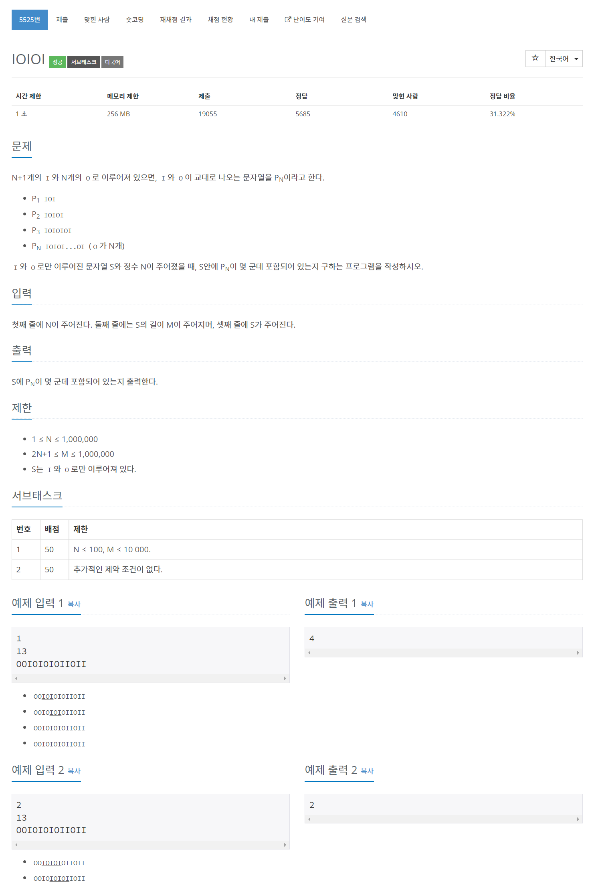

# [5525. IOIOI](https://www.acmicpc.net/problem/5525)




### My Answer

```python
n=int(input())
input()
def toBinary(s) : 
    return [1 if x=="I" else 0 for x in s]

arr = toBinary(input().strip()+"OO")

start = -1
stack = []
count = 0

for i in range(len(arr)-1) : 
    res = arr[i]^arr[i+1]
    if res : 
        if start==-1 : 
            start=i
        count+=1
    else : 
        if start!=-1 : 
            stack.append((start,i))
            start=-1
    
res = 0
for x in stack : 
    left, right = x
    if arr[left]==0 : 
        left+=1
    if arr[right]==0 : 
        right-=1
    
    if right-left+1 < 2*n+1 : continue
    res += (right-left+1 - 2*n+1)//2
    
print(res)

```

* Time Complexity : O(n)
* Space Complexity : O(n)


### The things I got
