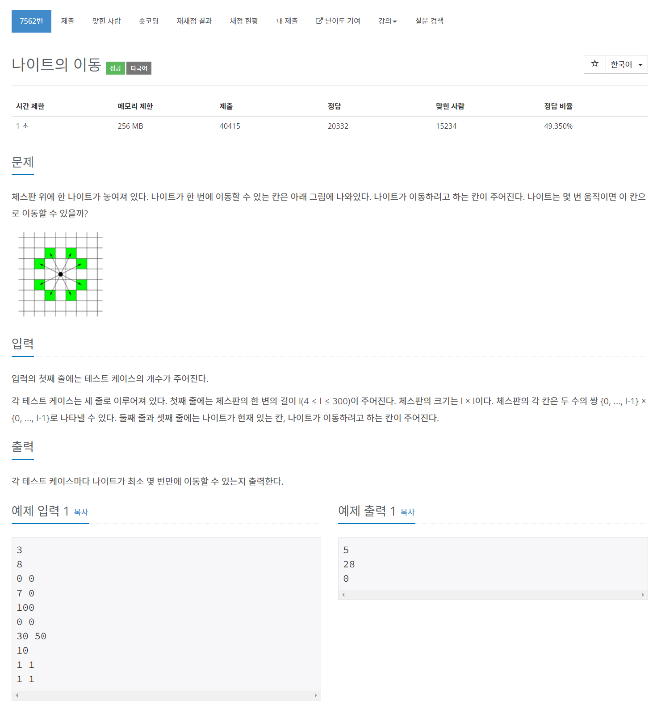

# [7562. 나이트의 이동](https://www.acmicpc.net/problem/7562)




### My Answer

```python
from collections import deque
import sys

input = sys.stdin.readline

def traverseKnight(l,now,dest) : 
    if now==dest : return 0
    chess = [[-1 for _ in range(l)] for _ in range(l)]
    chess[now[0]][now[1]]=0
    deq = deque()
    deq.append(now)
    while deq : 
        i,j = deq.popleft()
        
        x = (-2,-1,1,2,2,1,-1,-2)
        y = (1,2,2,1,-1,-2,-2,-1)
        
        for k in range(len(x)) : 
            ni,nj = i+x[k], j+y[k]
            if ni<0 or nj<0 or ni>=l or nj>=l or chess[ni][nj]!=-1 : continue
            if (ni,nj)==dest : return chess[i][j]+1
            chess[ni][nj]=chess[i][j]+1
            deq.append((ni,nj))
    
    return -1


for _ in range(int(input())) : 
    l = int(input())
    now = tuple(map(int,input().split()))
    dest = tuple(map(int,input().split()))
    print(traverseKnight(l,now,dest))
```

* Time Complexity : O(n^2)
* Space Complexity : O(n^2)


### The things I got
