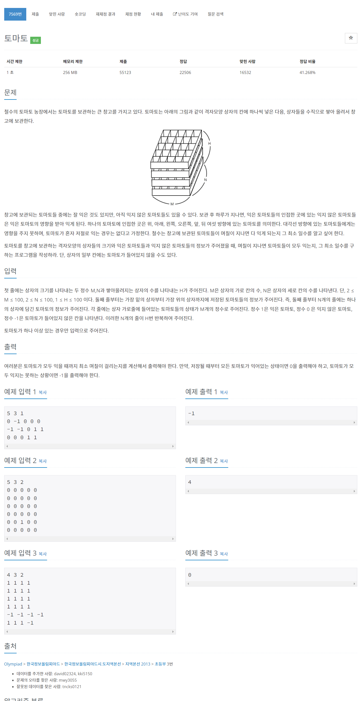

# [7569. 토마토](https://www.acmicpc.net/problem/7569)




### My Answer

```python
from collections import deque
import sys
sys.setrecursionlimit(10000000)

input = sys.stdin.readline

def getInputs() : 
    M,N,H = list(map(int,input().split()))
    box = [[list(map(int,input().split())) for _ in range(N)] for _ in range(H)]
    return M,N,H,box      

def tomato(M,N,H,box) : 
    deq = deque()
    already = False
    for k in range(len(box)) : 
        for j in range(len(box[0])) : 
            for i in range(len(box[0][0])) : 
                if box[k][j][i]==1 : 
                    deq.append((k,j,i,0))
                elif box[k][j][i]==0 : 
                    already = True

    x = (1,-1,0,0,0,0)
    y = (0,0,1,-1,0,0)
    z = (0,0,0,0,1,-1)

    res = 0
    while deq : 
        k,j,i,days = deq.popleft()
        res = max(res, days)

        for t in range(6) : 
            ni = i+y[t]
            nj = j+x[t]
            nk = k+z[t]
            if ni<0 or nj<0 or nk<0 or ni>=M or nj>=N or nk>=H or box[nk][nj][ni]!=0 : 
                continue
                
            box[nk][nj][ni]=1
            deq.append((nk,nj,ni,days+1))

    for k in range(len(box)) : 
        for j in range(len(box[0])) : 
            if 0 in box[k][j] : 
                return -1

    return res
    
print(tomato(*getInputs()))
```

* Time Complexity : O(N * M * H )
* Space Complexity : O(N * M * H )


### The things I got

