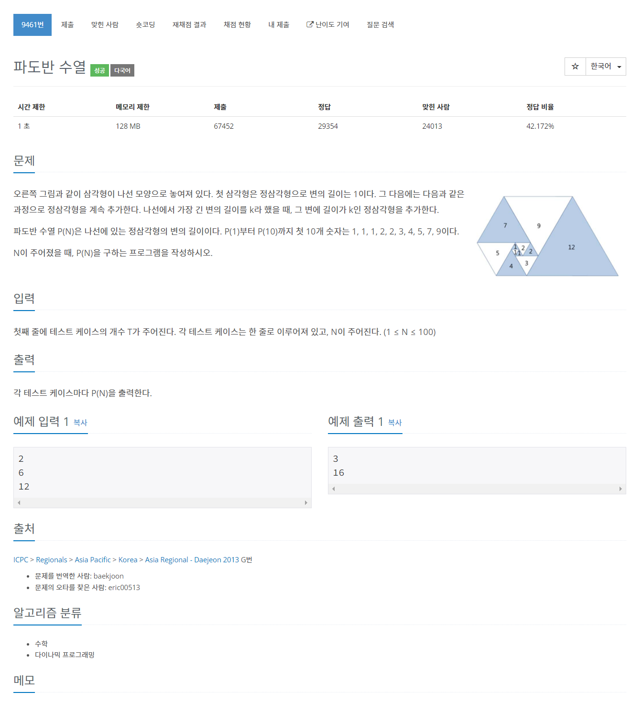

# [9461. 파도반 수열](https://www.acmicpc.net/problem/9461)




### My Answer

```python
import sys
N = int(input())
cases = [int(sys.stdin.readline()) for _ in range(N)]
dp = [1,1,1,2,2]
for i in range(5,max(cases)) : 
    dp.append(dp[i-1]+dp[i-5])
for x in cases : 
    print(dp[x-1])
```

* Time Complexity : O(n)
* Space Complexity : O(n)


### The things I got
