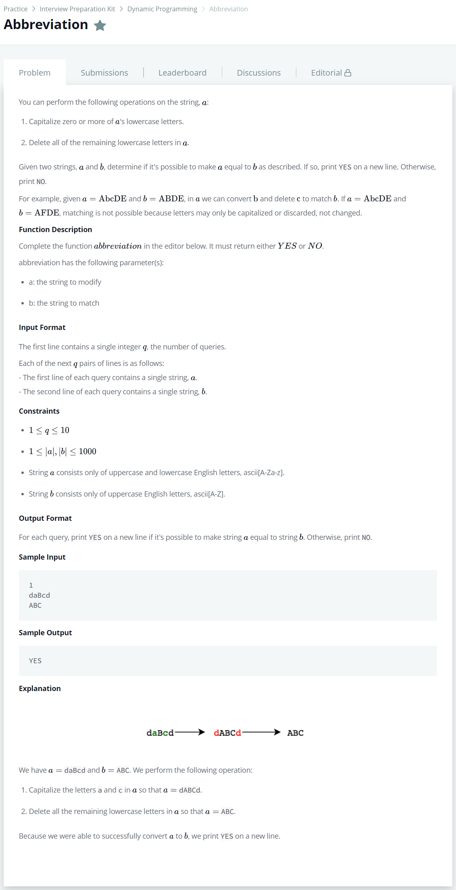
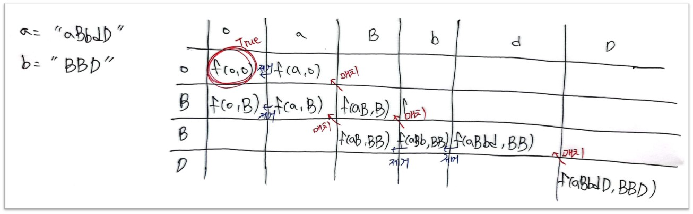

# [Abbreviation](https://www.hackerrank.com/challenges/abbr/problem)




### My Answer

```python
def abbreviation(a, b): 
    dp = [[0 for _ in range(len(a)+1)] for _ in range(len(b)+1)]
    dp[-1][-1]=1

    for i in reversed(range(len(dp))) : 
        for j in reversed(range(len(dp[0]))) :
            if dp[i][j]==1 : continue
            
            # case 1 : when end of characters matches
            if i<len(dp)-1 and j<len(dp[0])-1 and dp[i+1][j+1]==1 and a[j].upper()==b[i] :
                dp[i][j]=1

            # case 2 : when end of character removable
            elif j<len(dp[0])-1 and dp[i][j+1]==1 and a[j].islower() : 
                dp[i][j]=1

    if dp[0][0]==1 : 
        return 'YES'
    else : 
        return 'NO'
```

* Time Complexity : O(n)
* Space Complexity : O(2n)


### The things I got

일단 n으로 풀긴 했지만 대문자를 기준으로 DP를 작성해야 할 듯 싶다.  

1차 풀이 : B를 순회하면서 q에 넣고 -> pull하면서 대문자랑 맞는지 확인. 소문자면 간직해뒀다가 대문자가 나왔을 때 1회 면제용으로 사용.  

리뷰 : 쉽게볼게 아닌 것 같다. 뒤에서 대문자가 나온게 3번째 H인지 15번째 H인지 모른다. 흐음  

2차 풀이 : 다이나믹 프로그래밍을 더 깊게 이해하고 풀이하니 엄청나게 쉽게 풀렸다.  



다이나믹 프로그래밍은 sub-problems로 나누는게 가장 중요하다. 계속해서 연습하면서 감을 쌓아가도록 하자  

[다이나믹 프로그래밍 영상-1](https://youtu.be/eJC2oetXaNk)  

[다이나믹 프로그래밍 영상-2](https://youtu.be/rhda6lR5kyQ)  

