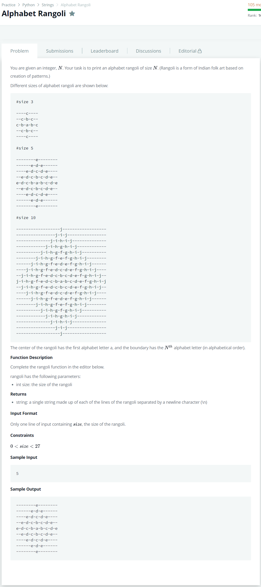

# [Alphabet Rangoli](https://www.hackerrank.com/challenges/alphabet-rangoli/problem)




### My Answer

```python
def print_rangoli(size):
    for i in range(size,0,-1) : 
        print(('-'.join([chr(x) for x in range(96+i,97+size)][::-1][:-1]+[chr(x) for x in range(96+i,97+size)])).center(size*4-3,'-'))
    for i in range(2,size+1) : 
        print(('-'.join([chr(x) for x in range(96+i,97+size)][::-1][:-1]+[chr(x) for x in range(96+i,97+size)])).center(size*4-3,'-'))
```

* Time Complexity : O(n)
* Space Complexity : O(1)


### The things I got
