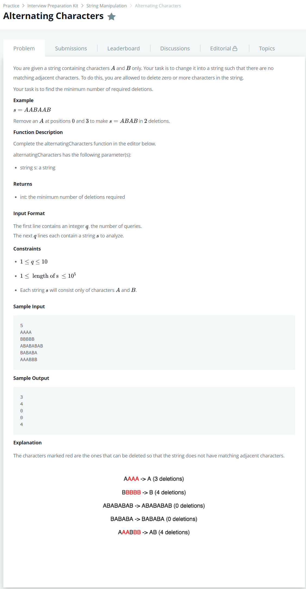

# [Alternating Characters](https://www.hackerrank.com/challenges/nested-list/problem)




### My Answer

```python
def alternatingCharacters(s):
    count=0
    previous=s[0]
    for x in s : 
        if x==previous : 
            count+=1
        else : 
            previous=x
            pass
    return count-1
```

* Time Complexity : O(n)
* Space Complexity : O(n)


### The things I got
