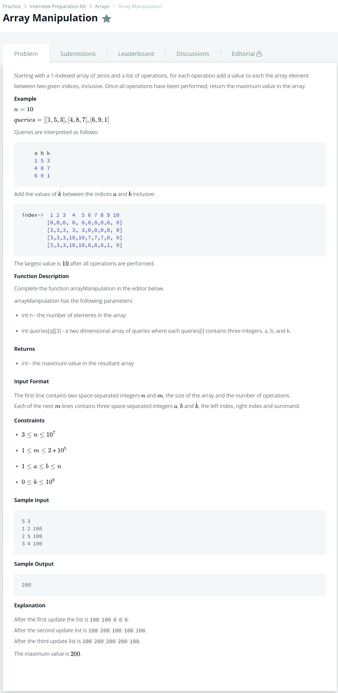

# [Array Manipulation](https://www.hackerrank.com/challenges/crush/problem)




### My Answer

```python
def arrayManipulation(n, queries):
    table = [0 for _ in range(n)]
    
    for query in queries : 
        table[query[0]-1]+=query[2]
        if query[1]<n : table[query[1]]-=query[2]
    
    value = 0
    maximum = 0
    for i in range(len(table)) : 
        value = value+table[i]
        if value>maximum : 
            maximum = value
    return maximum
```

* Time Complexity : O(n+k)
* Space Complexity : O(n)


### The things I got
