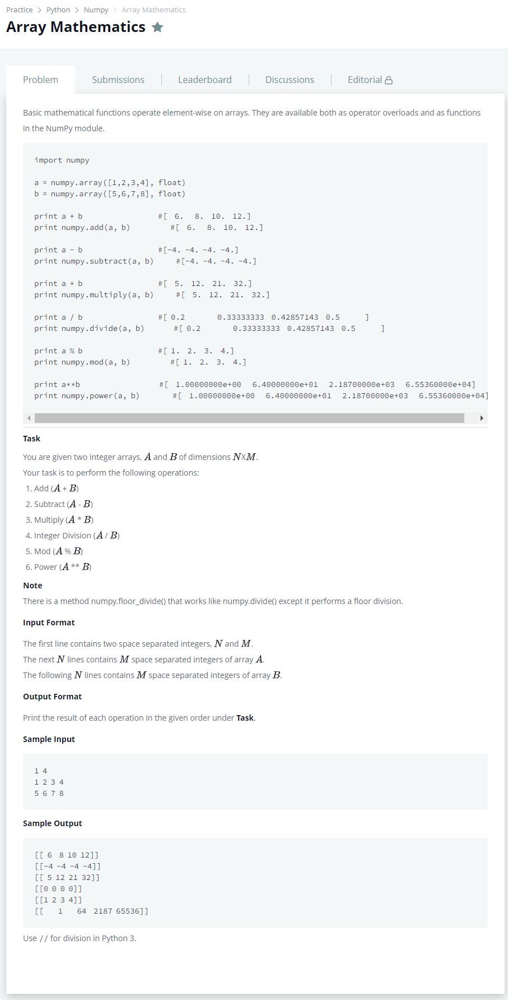

# [Array Mathematics](https://www.hackerrank.com/challenges/np-array-mathematics/problem)




### My Answer

```python
import numpy as np

N,M = [int(x) for x in input().split(' ')]

A = np.array([[int(x) for x in input().split(' ')] for _ in range(N)])
B = np.array([[int(x) for x in input().split(' ')] for _ in range(N)])

print(A+B)
print(A-B)
print(A*B)
print(A//B)
print(A%B)
print(A**B)
```

* Time Complexity : O(2n)
* Space Complexity : O(2n)


### The things I got
