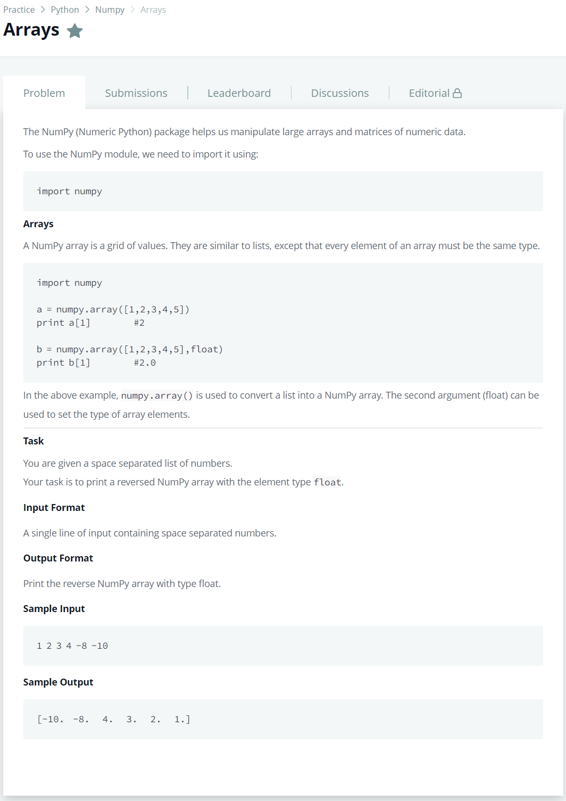

# [Arrays](https://www.hackerrank.com/challenges/np-arrays/problem)




### My Answer

```python
import numpy

def arrays(arr):
   return(numpy.array(arr[::-1], float))
```

* Time Complexity : O(1)
* Space Complexity : O(1)


### The things I got
