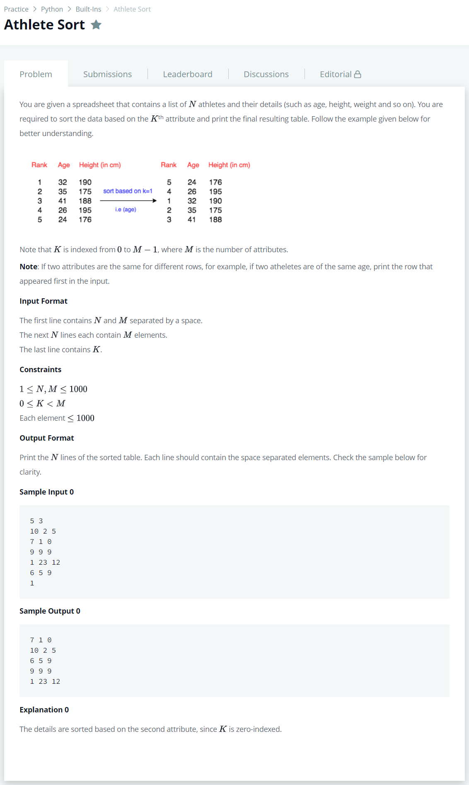

# [Athlete Sort](https://www.hackerrank.com/challenges/python-sort-sort/problem)




### My Answer

```python
if __name__ == '__main__':
    nm = input().split()
    n = int(nm[0])
    m = int(nm[1])
    arr = []
    for _ in range(n):
        arr.append(list(map(int, input().rstrip().split())))
    k = int(input())

    for x in sorted(arr,key=lambda x : x[k]) : 
        print(str(x).replace(',','')[1:-1])
```

* Time Complexity : O(n)
* Space Complexity : O(n)


### The things I got
