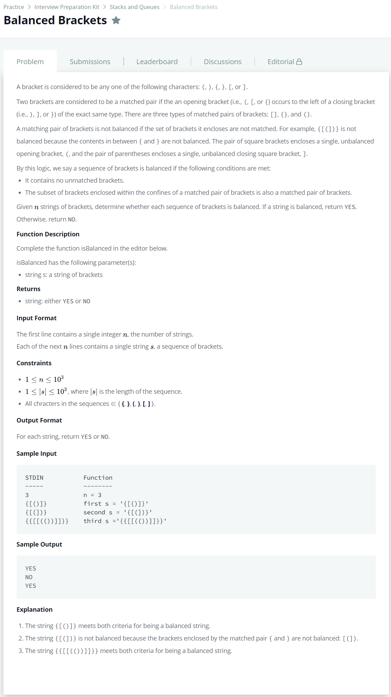

# [Balanced Brackets](https://www.hackerrank.com/challenges/balanced-brackets/problem)




### My Answer

```python
def meetOpposite(a,b)  :
    if a == '(' and b == ')' : 
        return True
    elif a == '{' and b == '}' : 
        return True
    elif a == '[' and b == ']' : 
        return True
    else : 
        return False

def top(stack) : 
    if len(stack)==0 : 
        return False
    else : 
        return stack[-1]
        
def isBalanced(s):
    stack = []
    for x in s : 
        if len(stack) and meetOpposite(top(stack),x) : 
            poped = stack.pop()
            #print(poped)
        else : 
            stack.append(x)
    if len(stack) : 
        return 'NO'
    else : 
        return 'YES'
```

* Time Complexity : O(n)
* Space Complexity : O(n)


### The things I got

이제 이 스킬을 좀 쓸 수 있겠다. Stack 스킬이네.  

