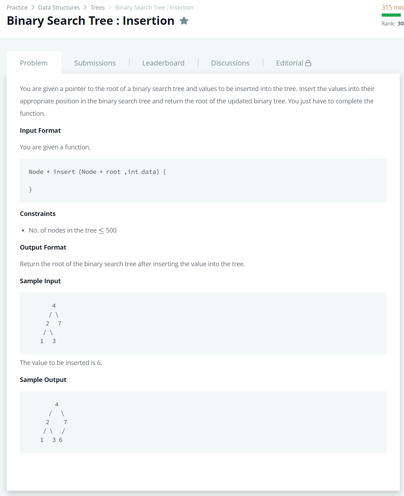

# [Binary Search Tree : Insertion](https://www.hackerrank.com/challenges/binary-search-tree-insertion/problem)




### My Answer

```python
class BinarySearchTree:
    def __init__(self): 
        self.root = None
        
	def insert(self, val):
        if self.root == None : 
            self.root=Node(val)
        else : 
            self.traverse(self.root,val)
                
    def traverse(self,node,val) : 
        if node.info>val : 
            if node.left==None : 
                node.left=Node(val)
            else : 
                self.traverse(node.left,val)
        else : 
            if node.right==None : 
                node.right=Node(val)
            else : 
                self.traverse(node.right,val)
```

* Time Complexity : O(n)
* Space Complexity : O(n)


### The things I got
