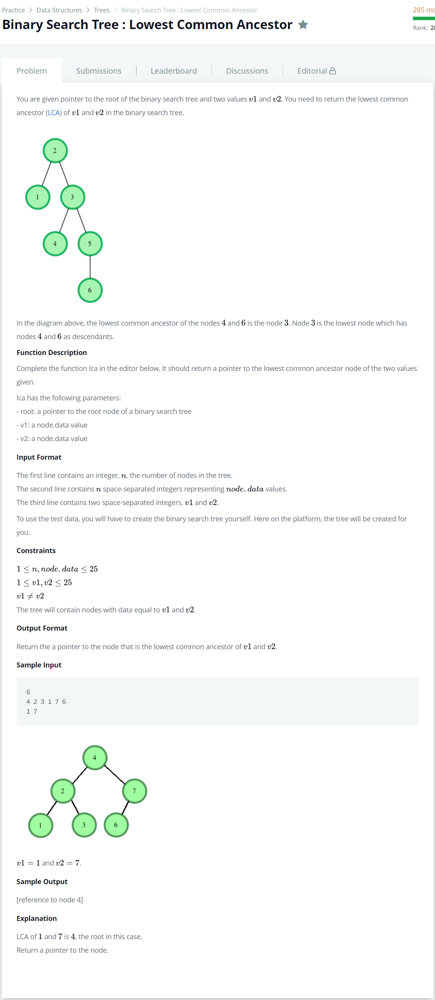

# [Binary Search Tree : Lowest Common Ancestor](https://www.hackerrank.com/challenges/binary-search-tree-lowest-common-ancestor/problem)




### My Answer

```python
def lca(root, v1, v2):
    sm, bg = sorted([v1,v2])
    if sm < root.info and bg > root.info : 
        return root
    elif root.info in (bg,sm) : 
        return root
    elif sm > root.info :
        return lca(root.right,v1,v2)
    elif bg < root.info : 
        return lca(root.left,v1,v2)
    else : 
        print(root.info,v1,v2)
        raise(Exception("Error"))
```

* Time Complexity : O(n)
* Space Complexity : O(n)


### The things I got
