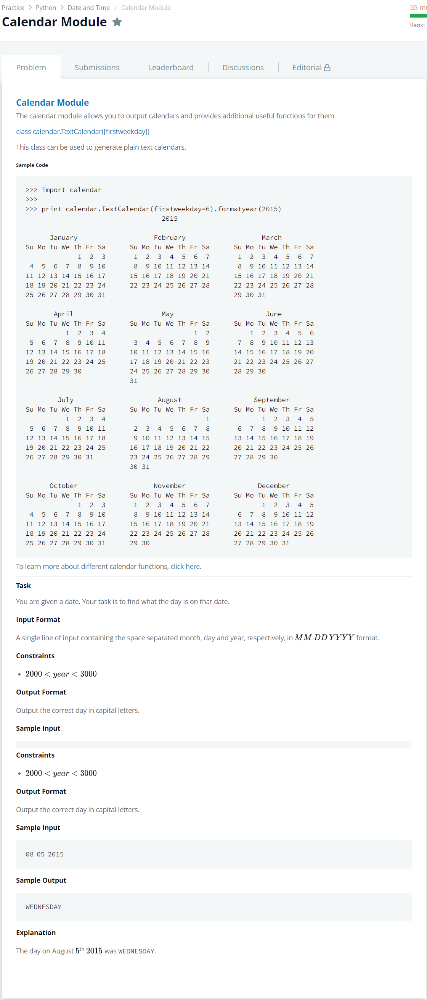

# [Calendar Module](https://www.hackerrank.com/challenges/calendar-module/problem)




### My Answer

```python
import sys
import calendar

month, day, year = sys.stdin.readline().split(' ')
days = ['SUNDAY','MONDAY','TUESDAY','WEDNESDAY','THURSDAY','FRIDAY','SATURDAY']

sunday = calendar.TextCalendar(firstweekday=6).formatmonth(int(year),int(month)).split('\n')[3].split(' ')[1]

print(days[(int(day) - int(sunday))%7])
```

* Time Complexity : O(1)
* Space Complexity : O(1)


### The things I got
