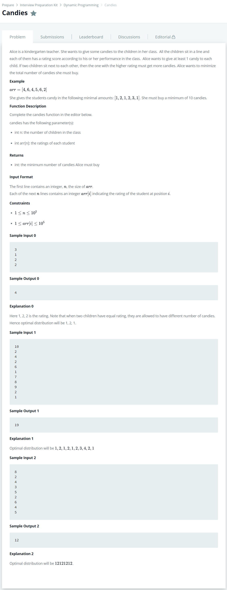

# [Candies](https://www.hackerrank.com/challenges/candies/problem)




### My Answer

```python
def candies(n, arr):
    minArr1 = [1 for i in range(len(arr))]
    minArr2 = [1 for i in range(len(arr))]
    finalArr = []

    for i in range(1,len(arr)):
        if arr[i] > arr[i-1]:
            minArr1[i]=minArr1[i-1]+1
        else:
            minArr1[i] = 1

    for j in range(len(arr)-2,-1,-1):
        if arr[j] > arr[j+1]:
            minArr2[j] = minArr2[j+1] +1
        else:
            minArr2[j] = 1

    for i in range(len(arr)):
        finalArr.append(max(minArr1[i], minArr2[i]))
        
    return sum(finalArr)
```

* Time Complexity : O(2n)
* Space Complexity : O(2n)


### The things I got

왼쪽 sort와 오른쪽 sort? 가 있는 경우에는 왼쪽 오른쪽을 따로 나눠서 연산을 해주고 합쳐주자.  

보통 nlog(n)이 2n으로 끝나는 경우가 많다.  

