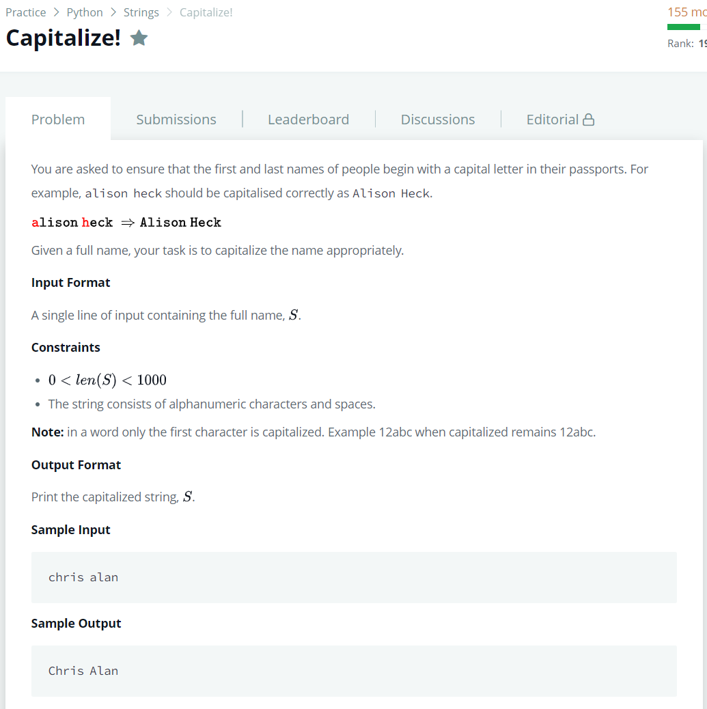

# [Nested Lists](https://www.hackerrank.com/challenges/nested-list/problem)




### My Answer

```python
def solve(s):
    return ' '.join([x.capitalize() for x in s.split(' ')])
```

* Time Complexity : O(n)
* Space Complexity : O(1)


### The things I got
