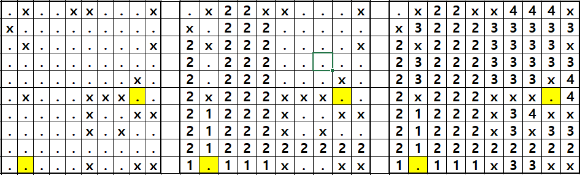

# [Castle On The Grid](https://www.hackerrank.com/challenges/castle-on-the-grid/problem)


### My Answer

```python

def minimumMoves(grid, startX, startY, goalX, goalY):
    
    #switch coordinate
    startX, startY, goalX, goalY = startY, startX, goalY, goalX
    
    #turn grid into lists
    grid = [list(x) for x in grid]
    
    #initialize queue
    q = Queue()
    q.put((startX, startY))
    
    #setting value
    grid[startY][startX] = 0
    
    while q.qsize() : 
        
        startX,startY = q.get()
        right, left, up, down = startX, startX, startY, startY
        value = grid[startY][startX]+1
        
        #Right
        if startX<n-1: 
            for right in range(startX,n-1) :
                if (right+1,startY) == (startX,startY) : #immidiate return
                    return value
                if grid[startY][right+1]=='X' : break
                else : 
                    if grid[startY][right+1] == '.' : 
                        grid[startY][right+1] = value
                        q.put((right+1, startY))

        #Left
        if startX>0: 
            for left in range(startX,0,-1) : 
                if (left-1,startY) == (startX,startY) :  #immidiate return
                    return value
                if grid[startY][left-1]=='X' : break
                else : 
                    if grid[startY][left-1] == '.': 
                        grid[startY][left-1] = value
                        q.put((left-1, startY))
        
        #Down
        if startY<n-1:
            for down in range(startY,n-1) :
                if (startX,down+1) == (startX,startY) :  #immidiate return
                    return value
                if grid[down+1][startX]=='X' : break
                else : 
                    if grid[down+1][startX] == '.': 
                        grid[down+1][startX] = value
                        q.put((startX, down+1))

        #Up
        if startY>0:
            for up in range(startY,0,-1) : 
                if (startX,up-1) == (startX,startY) : #immidiate return
                    return value
                if grid[up-1][startX]=='X' : break
                else : 
                    if grid[up-1][startX] == '.': 
                        grid[up-1][startX] = value
                        q.put((startX, up-1))

    return grid[goalY][goalX]
    
```

* Time Complexity : O(?) 아마 n^2..?
* Space Complexity : O(n)


### The things I got

스택으로 해도 되는데 recursion이 좀 더 편해보여서 이걸로 구현했다.  

스택으로 하면 갈림길까지 스택 쌓았다가 뺐다가 하는 느낌으로 하면 될듯  

아니면 계산기 만드는 느낌도 괜찮을거같고(up,down,left,right)  

  

아니다. 원래 방법으로 하면 brute force와 다름이 없다.

이 문제는 사천성 게임처럼 장애물을 피해서 최소의 회전으로 연결해야하는 문제임.  

  

  위와 같이 target cell을 기준으로 가로 세로를 모두 확인하고 queue에 넣은 뒤 하나씩 뽑으면서 모든 cell을 확인한다. 

