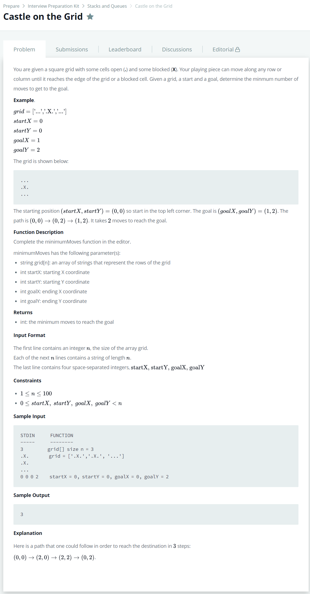

# [Castle On The Grid](https://www.hackerrank.com/challenges/castle-on-the-grid/problem)




### My Answer

```python
def recursion(grid, startX, startY, goalX, goalY, flag):
    print("({},{})".format(startX, startY))
    n = len(grid)
    already = 0
    
    if startX==goalX and startY==goalY : 
        return 1
    
    #Right
    if flag!="l" and startX<n-1 and grid[startY][startX+1]=='.': 
        print("Right")
        endX=0
        for endX in range(startX,n-1) :
            if endX==goalX and startY==goalY : return 1
            elif grid[startY][endX+1]=='X' : break
        if endX==n-2 and grid[startY][n-1]=='.': 
            endX=n-1
        already = recursion(grid, endX, startY, goalX, goalY, "r")
        
    #Left
    if flag!="r" and not already and startX>0 and grid[startY][startX-1]=='.' : 
        print("Left")
        endX=0
        for endX in range(startX,0,-1) : 
            if endX==goalX and startY==goalY : return 1
            elif grid[startY][endX-1]=='X' : break
        if endX==1 and grid[startY][0]=='.': 
            endX=0
        already = recursion(grid, endX, startY, goalX, goalY, "l")
     
    #Down
    if flag!="u" and not already and startY<n-1 and grid[startY+1][startX]=='.':
        print("Down")
        endY=0
        for endY in range(startY,n-1) :
            if startX==goalX and endY==goalY : return 1
            elif grid[endY+1][startX]=='X' : break
        if endY==n-2 and grid[n-1][startX]=='.': 
            endY=n-1
        already = recursion(grid, startX, endY, goalX, goalY, "d")
        
    #Up
    if flag!="d" and not already and startY>0 and grid[startY][startX-1]=='.' :
        print("Up")
        endY=0
        for endY in range(startY,0,-1) : 
            if startX==goalX and endY==goalY : return 1
            elif grid[endY-1][startX]=='X' : break
        if endY==1 and grid[0][startX]=='.': 
            endY=0
        already = recursion(grid, startX, endY, goalX, goalY, "u")
    
    return already+1
    # Write your code here
    
def minimumMoves(grid, startX, startY, goalX, goalY):
    return recursion(grid, startX, startY, goalX, goalY,"")-1
```

* Time Complexity : O(n)
* Space Complexity : O(n)


### The things I got

스택으로 해도 되는데 recursion이 좀 더 편해보여서 이걸로 구현했다.  

스택으로 하면 갈림길까지 스택 쌓았다가 뺐다가 하는 느낌으로 하면 될듯  

아니면 계산기 만드는 느낌도 괜찮을거같고(up,down,left,right)  