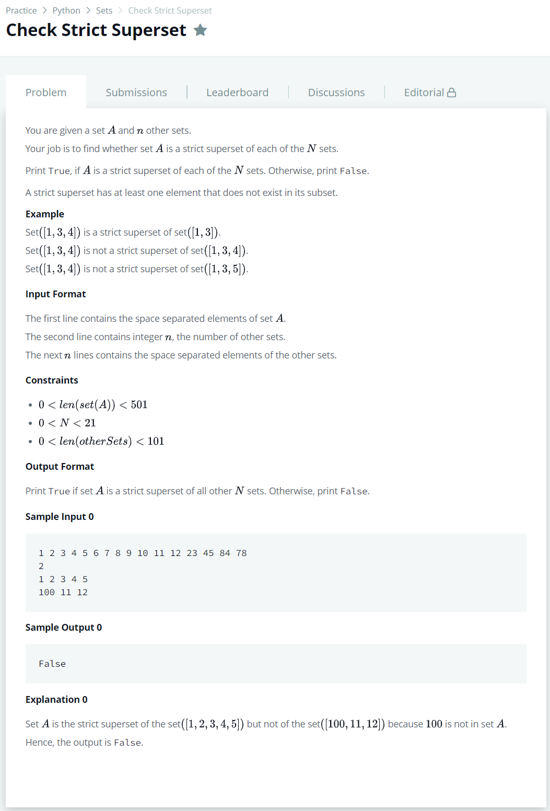

# [Check Strict Superset](https://www.hackerrank.com/challenges/py-check-strict-superset/problem)




### My Answer

```python
A = input().split()
print(all([set(input().split()).issubset(A) for _ in range(int(input()))]))
```

* Time Complexity : O(n)
* Space Complexity : O(n)


### The things I got
