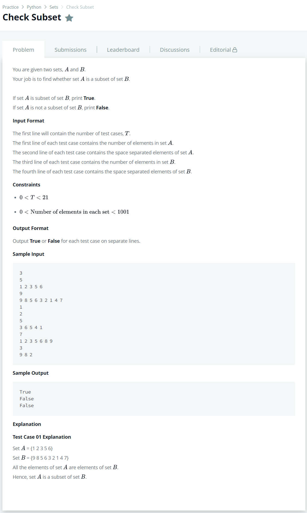

# [Check Subset](https://www.hackerrank.com/challenges/py-check-subset/problem)




### My Answer

```python
for _ in range(int(input())):
    _,A = input(), set(input().split())
    _,B = input(), set(input().split())
    print(A.issubset(B))
```

* Time Complexity : O(n)
* Space Complexity : O(n)


### The things I got
