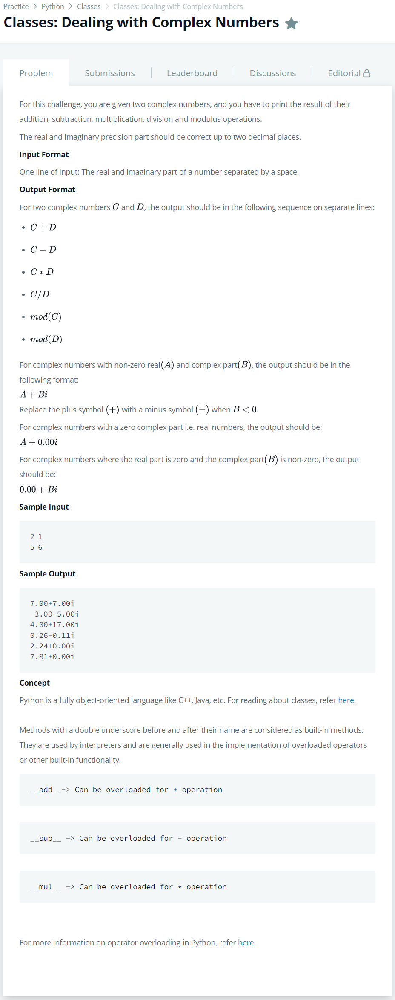

# [Classes: Dealing with Complex Numbers](https://www.hackerrank.com/challenges/class-1-dealing-with-complex-numbers/problem)




### My Answer

```python
import math

class Complex(object):
    def __init__(self, real, imaginary):
        self.real = real
        self.imaginary = imaginary
    def __add__(self, no):
        return Complex(self.real+no.real, self.imaginary+no.imaginary)
    def __sub__(self, no):
        return Complex(self.real-no.real, self.imaginary-no.imaginary)
    def __mul__(self, no):
        return Complex(self.real*no.real-self.imaginary*no.imaginary,self.real*no.imaginary+self.imaginary*no.real)
    def __truediv__(self, no):
        return Complex((self.real*no.real+self.imaginary*no.imaginary)/(no.real**2+no.imaginary**2),(-1*self.real*no.imaginary+self.imaginary*no.real)/(no.real**2+no.imaginary**2))
    def mod(self):
        return Complex((self.real**2+self.imaginary**2)**.5,0)
    def __str__(self):
        if self.imaginary == 0:
            result = "%.2f+0.00i" % (self.real)
        elif self.real == 0:
            if self.imaginary >= 0:
                result = "0.00+%.2fi" % (self.imaginary)
            else:
                result = "0.00-%.2fi" % (abs(self.imaginary))
        elif self.imaginary > 0:
            result = "%.2f+%.2fi" % (self.real, self.imaginary)
        else:
            result = "%.2f-%.2fi" % (self.real, abs(self.imaginary))
        return result

if __name__ == '__main__':
```

* Time Complexity : O(1)
* Space Complexity : O(1)


### The things I got
