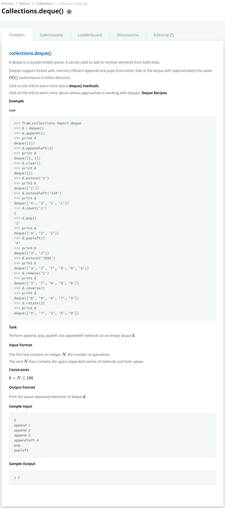

# [Collections Deque](https://www.hackerrank.com/challenges/py-collections-deque/problem)




### My Answer

```python
from collections import deque
d = deque()
for _ in range(int(input())):
    inp = input().split()
    getattr(d, inp[0])(*[inp[1]] if len(inp) > 1 else [])
print(*[item for item in d])
```

* Time Complexity : O(n)
* Space Complexity : O(n)


### The things I got
