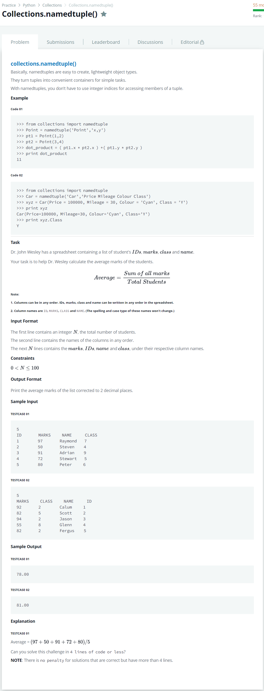

# [Collections namedtuple()](https://www.hackerrank.com/challenges/py-collections-namedtuple/problem)  




### My Answer

```python
import sys
from collections import namedtuple

counts = int(sys.stdin.readline())
col = list(filter(lambda x : x, sys.stdin.readline().replace('\n','').split(' ')))

Student = namedtuple('Student',col)
total=0
for i in range(counts) : 
    info = list(filter(lambda x : x, sys.stdin.readline().replace('\n','').split(' ')))
    ID = col.index('ID')
    MARKS = col.index('MARKS')
    NAME = col.index('NAME')
    CLASS = col.index('CLASS')
    
    student_A = Student(ID = info[ID],
                        MARKS = info[MARKS],
                        NAME = info[NAME],
                        CLASS = info[CLASS])
                      
    total += int(student_A.MARKS)

average = '%.2f' %(total/counts)
print(average)
```

* Time Complexity : O(n)
* Space Complexity : O(n)


### The things I got
