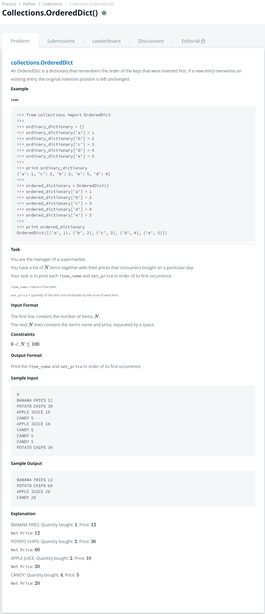

# [Collections.OrderedDict()](https://www.hackerrank.com/challenges/py-collections-ordereddict/problem)




### My Answer

```python
from collections import OrderedDict

ordinary_dictionary = OrderedDict()
for _ in range(int(input())) : 
    *key, value = input().replace('\n','').split(' ')
    key = ' '.join(key)
    if key not in ordinary_dictionary : 
        ordinary_dictionary[key]=int(value)
    else : 
        ordinary_dictionary[key]+=int(value)
    
for k,v in ordinary_dictionary.items() : 
    print('{} {}'.format(k,v))
```

* Time Complexity : O(n)
* Space Complexity : O(n)


### The things I got
