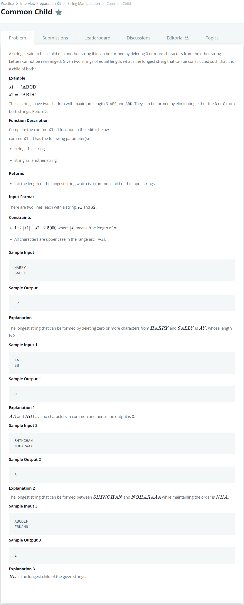

# [Common Child](https://www.hackerrank.com/challenges/common-child/problem)




### My Answer

```python
def commonChild(s1, s2):
    LCS_len = 0
    s1 = '0'+s1
    s2 = '0'+s2
    
    table=[[ 0 for _ in range(len(s2))] for _ in range(len(s1))]
    
    for i in range(1,len(s1)) : 
        maximum = 0
        for j in range(1,len(s2)) : 
            if s1[i]==s2[j] : 
                maximum = table[i-1][j-1]+1
                table[i][j] = maximum
            else : 
                if table[i][j-1] > table[i-1][j] : 
                    table[i][j] = table[i][j-1]
                else : 
                    table[i][j] = table[i-1][j]
        if LCS_len < maximum : 
            LCS_len = maximum
    
    return LCS_len
```

* Time Complexity : O(n^2)
* Space Complexity : O(n^2)


### The things I got

LCS LCS LCS!!!