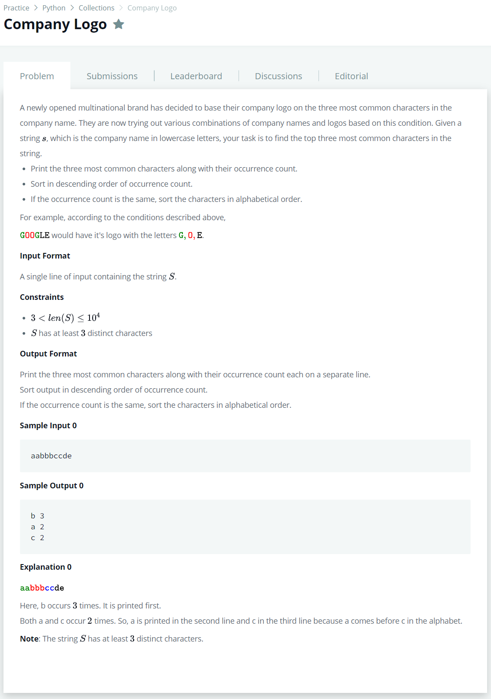

# [Company Logo](https://www.hackerrank.com/challenges/most-commons/submissions/code/226191013)




### My Answer

```python
#!/bin/python3

import math
import os
import random
import re
import sys
from collections import defaultdict
import operator


if __name__ == '__main__':
    alphabet = defaultdict(int)
    for x in input() : 
        alphabet[x]+=1
        
        
    for x in sorted(sorted(alphabet.items()),key=operator.itemgetter(1),reverse=True)[:3] : 
        print(*x)
```

* Time Complexity : O(n)
* Space Complexity : O(n)


### The things I got
