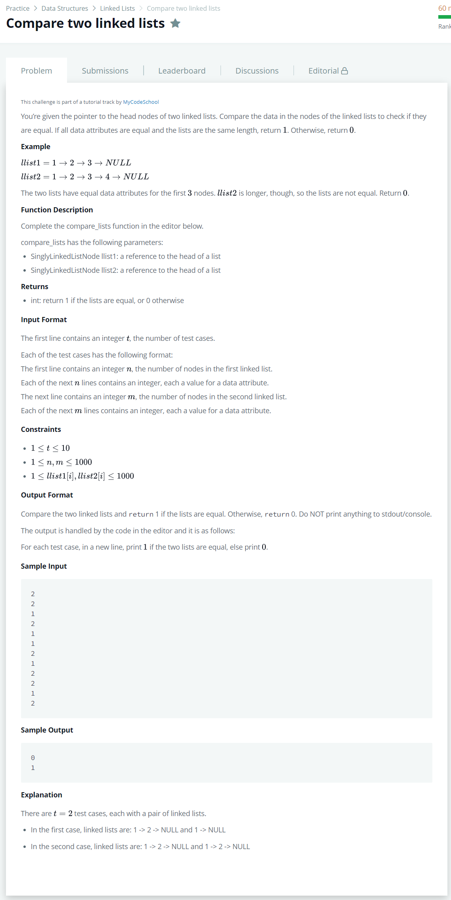

# [Compare two linked lists](https://www.hackerrank.com/challenges/compare-two-linked-lists/problem?isFullScreen=false)




### My Answer

```python
def compare_lists(llist1, llist2):
    while llist1.next or llist2.next : 
        if llist1.data!=llist2.data : 
            return 0
        if bool(llist1.next)^bool(llist2.next) : 
            return 0     
        llist1 = llist1.next
        llist2 = llist2.next
    return 1
```

* Time Complexity : O(n)
* Space Complexity : O(n)


### The things I got
