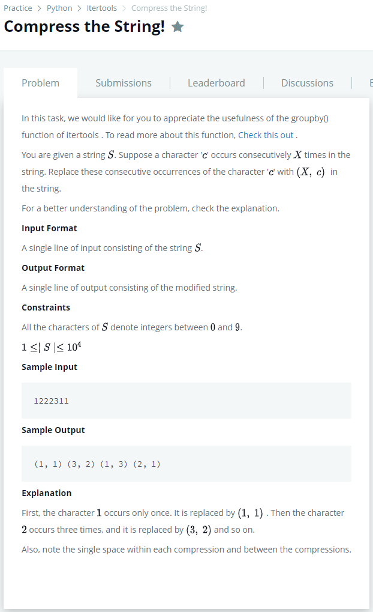

# [Compress the String!](https://www.hackerrank.com/challenges/compress-the-string/problem)




### My Answer

```python
character = ''
count=0
for x in input()+'\0' : 
    if character == x : 
        count+=1
    elif character == '' : 
        character=x
        count+=1
        continue
    else : 
        print((count,int(character)),end=' ')
        character=x
        count=1
```

* Time Complexity : O(n)
* Space Complexity : O(n)


### The things I got
