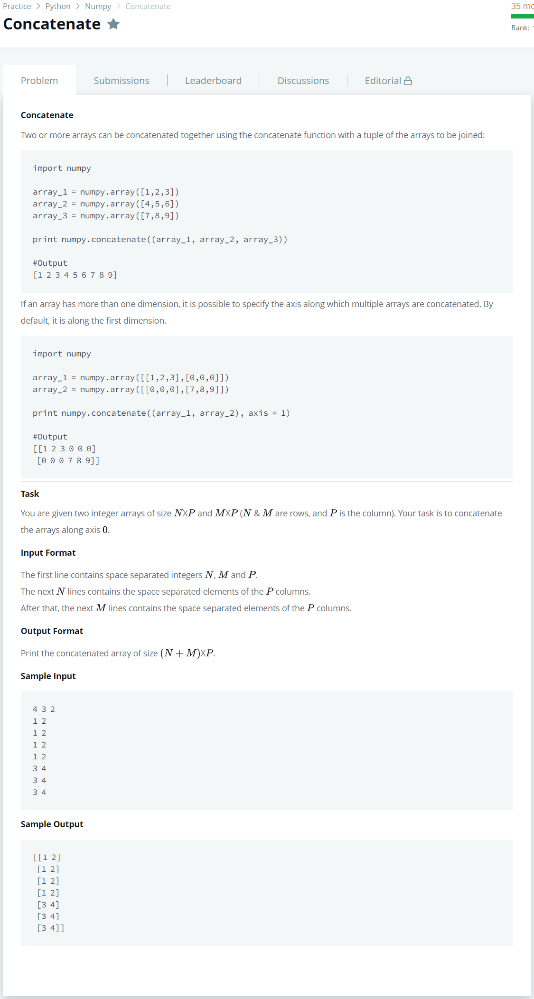

# [Concatenate](https://www.hackerrank.com/challenges/np-concatenate/problem)




### My Answer

```python
import numpy as np
import sys

n,m,p = list(map(lambda x : int(x),sys.stdin.readline().split(' ')))

array1 = np.array([list(map(lambda x : int(x),sys.stdin.readline().replace('\n','').split(' '))) for _ in range(n)])
array2 = np.array([list(map(lambda x : int(x),sys.stdin.readline().replace('\n','').split(' '))) for _ in range(m)])

print(np.concatenate((array1,array2),axis=0))

```

* Time Complexity : O(n)
* Space Complexity : On)


### The things I got
