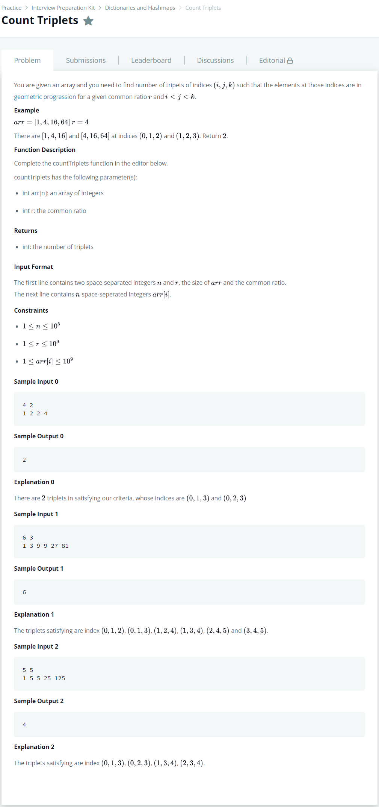

# [Count Triplets](https://www.hackerrank.com/challenges/count-triplets-1/problem)




### My Answer

```python
def countTriplets(arr, r):
    if r==1 : 
        countmap_single = defaultdict(int)
        for x in arr : 
            countmap_single[x]+=1
        count=0
        for v in countmap_single.values() : 
            count+=(v*(v-1)*(v-2))//6
        return count
        
    else : 
        countmap_single = defaultdict(int)
        countmap_reduced = defaultdict(int)
        count=0
        for x in arr : 
            countmap_single[x]+=1
            countmap_reduced[x]+=countmap_single[x/r]
            count+=countmap_reduced[x/r]
        return count
```

* Time Complexity : O(n)
* Space Complexity : O(2n)


### The things I got

순서를 잘 생각하자  