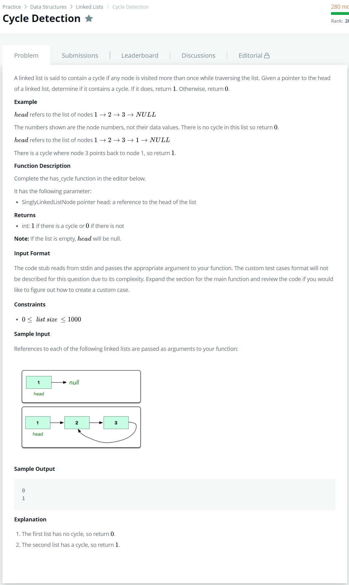

# [Cycle Detection](https://www.hackerrank.com/challenges/detect-whether-a-linked-list-contains-a-cycle/problem)




### My Answer

```python
def has_cycle(head):
    for i in range(1000) : 
        if head.next==None : 
            return 0
        head = head.next
    return 1
```

* Time Complexity : O(1000)
* Space Complexity : O(1)


### The things I got
