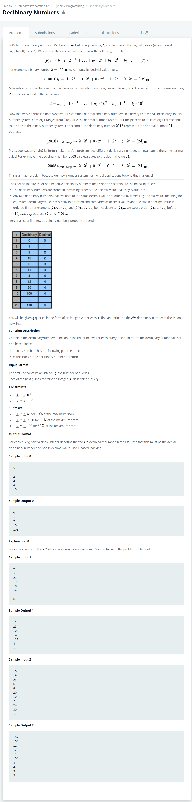

# [Decibinary Numbers](https://www.hackerrank.com/challenges/decibinary-numbers/problem)




### My Answer

```python
def findValueWithBinary(base_digit, nth) : 
    sum=0
    length = len(bin(base_digit)[2:])
    
    for i,x in enumerate(bin(base_digit)[:1:-1]) :
        sum+=int(x)*2**i
    
def decibinaryNumbers(x):
    power_count=1
    n=2
    an_1 = [1]
    count=1
    print("an : {}".format(an_1))
    while True : 
        print("n : {}, power_count : {}".format(n,power_count))
        if n%2==0 : 
            if 2**power_count==n : 
                an = [1]+[an_1[i]+an_1[i+1] for i in range(len(an_1)-1)]+[1]
                power_count+=1
            else : 
                an = [0]+[an_1[i]+an_1[i+1] for i in range(len(an_1)-1)]+[0]
        else :
            an = [0]+[an_1[i]+an_1[i+1] for i in range(len(an_1)-1)]
            
        print("an : {}".format(an))
        count+=sum(an)
        if count>x : break
        else : 
            an_1 = an.copy()
            n+=1
    
    print("fianl // n : {}, Count : {}".format(n, count))
    print("========End=========")
```

* Time Complexity : O(?)
* Space Complexity : O(?)


### The things I got
