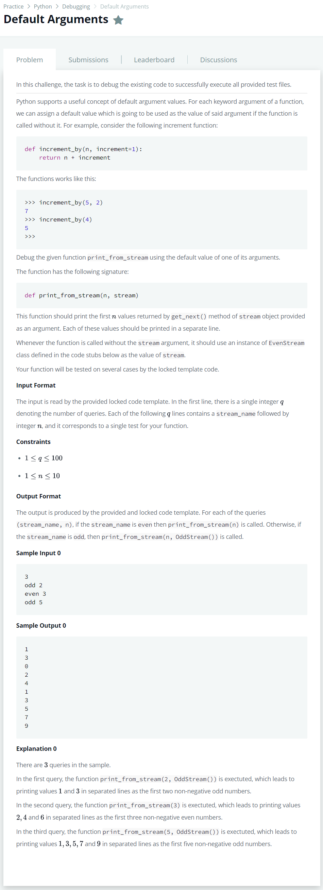

# [Default Arguments](https://www.hackerrank.com/challenges/nested-list/problem)




### My Answer

```python
class EvenStream(object):
    def __init__(self):
        self.current = 0

    def get_next(self):
        to_return = self.current
        self.current += 2
        return to_return

class OddStream(object):
    def __init__(self):
        self.current = 1

    def get_next(self):
        to_return = self.current
        self.current += 2
        return to_return

def print_from_stream(n, stream=EvenStream()):
    stream.__init__()
    for _ in range(n):
        print(stream.get_next())
```

* Time Complexity : O(n)
* Space Complexity : O(n)


### The things I got
