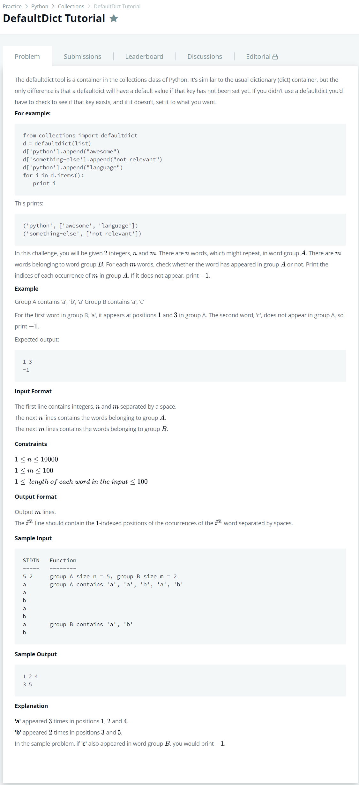

# [DefaultDict Tutorial](https://www.hackerrank.com/challenges/defaultdict-tutorial/problem)




### My Answer

```python
import sys
from collections import defaultdict
d = defaultdict(list)

n,m = sys.stdin.readline().split(' ')
n,m = int(n),int(m)

for i in range(n) : 
    d['A'].append(sys.stdin.readline().replace('\n',''))
    
for j in range(m) : 
    d['B'].append(sys.stdin.readline().replace('\n',''))

for x in d['B'] : 
    if x in d['A'] : 
        print(str([i+1 for i in range(len(d['A'])) if d['A'][i]==x]).replace(',','')[1:-1])
    else : 
        print(-1)
```

* Time Complexity : O(n)
* Space Complexity : O(n)


### The things I got
