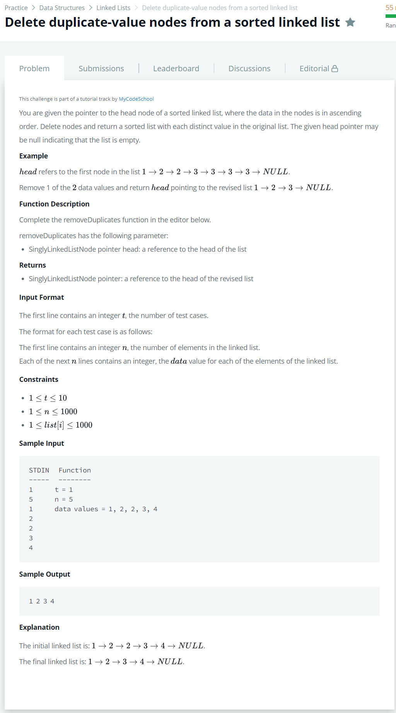

# [Delete duplicate-value nodes from a sorted linked list](https://www.hackerrank.com/challenges/delete-duplicate-value-nodes-from-a-sorted-linked-list/problem)




### My Answer

```python
def removeDuplicates(llist):
    Head = llist.next
    Tail = llist
    while Head : 
        if Head.data != Tail.data : 
            Tail.next = Head
            Tail=Head
        Head = Head.next
    if Head == None : 
        Tail.next = Head
    return llist
```

* Time Complexity : O(n)
* Space Complexity : O(n)


### The things I got
