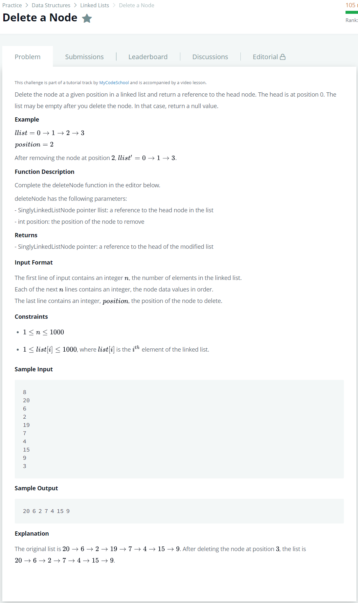

# [Delete a Node](https://www.hackerrank.com/challenges/delete-a-node-from-a-linked-list/problem)




### My Answer

```python
def deleteNode(llist, position):
    if position==0 : 
        return llist.next
    head, tail = llist, llist
    while(tail.next) : 
        head = tail.next
        position-=1
        if position==0 : 
            head = head.next
            tail.next = head
        else : 
            tail = head
    return llist
```

* Time Complexity : O(n)
* Space Complexity : O(n)


### The things I got
