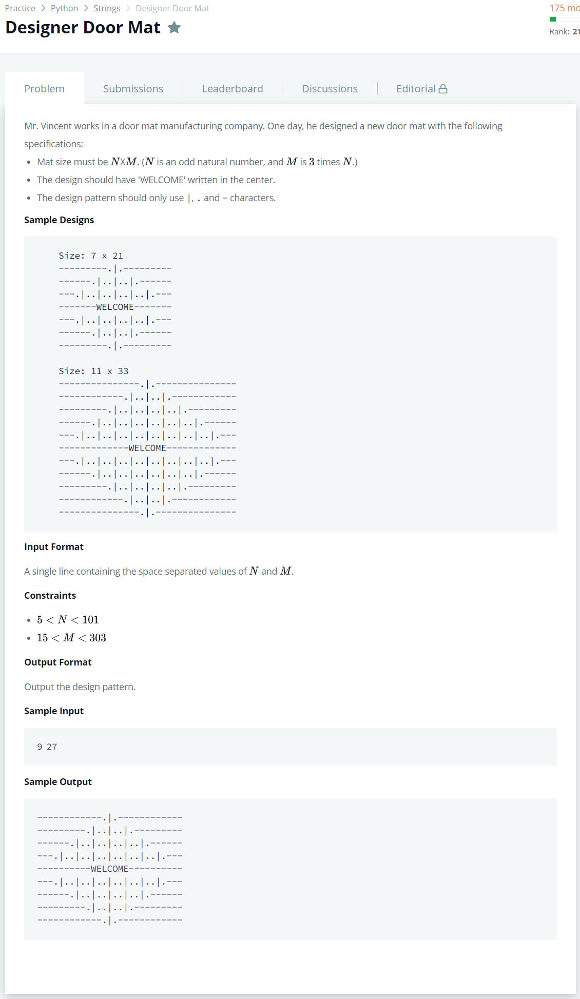

# [Designer Door Mat](https://www.hackerrank.com/challenges/designer-door-mat/problem)




### My Answer

```python
import sys 

num = int(sys.stdin.readline().split(' ')[0])
for n in range(1,num//2+1) : 
    print((".|."*(2*n-1)).center(num*3,'-'))
print("WELCOME".center(num*3,'-'))
for n in range(num//2,0,-1) : 
    print((".|."*(2*n-1)).center(num*3,'-'))
```

* Time Complexity : O(n)
* Space Complexity : O(1)


### The things I got
