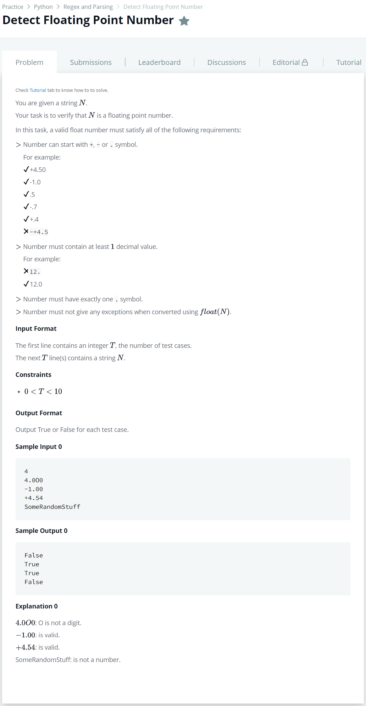

# [DetectFloatingPointNumber](https://www.hackerrank.com/challenges/introduction-to-regex/problem)




### My Answer

```python
import re

p = re.compile('[+-]?[0-9]*[.][0-9]*[0-9]$')
for _ in range(int(input())) : 
    print(True if p.match(input()) else False)
```

* Time Complexity : O(1)
* Space Complexity : O(1)


### The things I got
