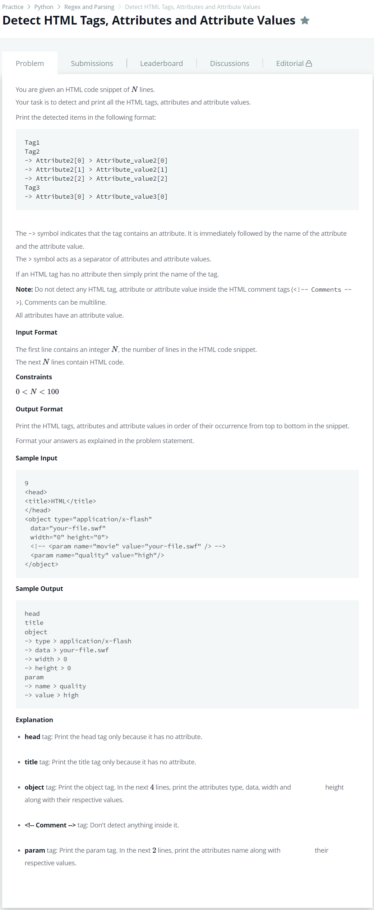

# [Detect HTML Tags, Attributes and Attribute Values](https://www.hackerrank.com/challenges/detect-html-tags-attributes-and-attribute-values/problem)




### My Answer

```python
from html.parser import HTMLParser

# create a subclass and override the handler methods
class MyHTMLParser(HTMLParser):
    def handle_starttag(self, tag, attrs):
        print (tag)
        for attr in attrs:
            print ("->", ' > '.join([str(x) for x in attr]))
    def handle_startendtag(self, tag, attrs):
        print (tag)
        for attr in attrs:
            print ("->", ' > '.join([str(x) for x in attr]))

# instantiate the parser and fed it some HTML
parser = MyHTMLParser()
for _ in range(int(input())) : 
    parser.feed(input())
```

* Time Complexity : O(1)
* Space Complexity : O(1)


### The things I got
