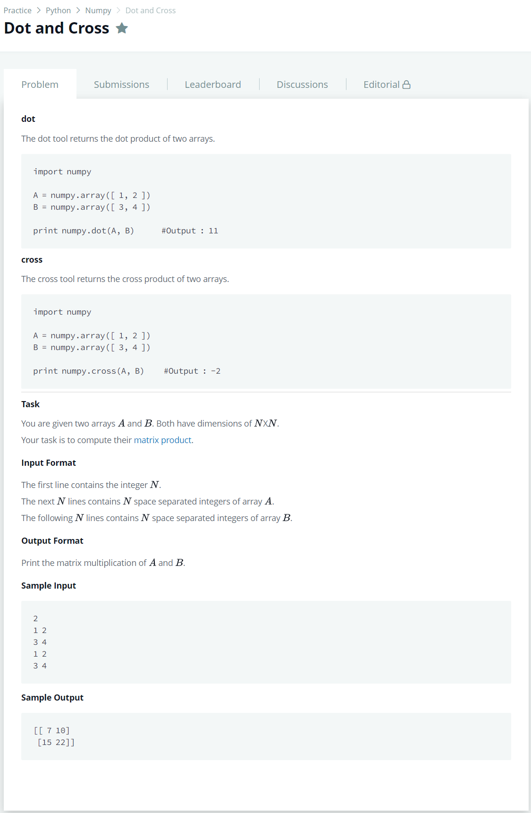

# [Dot and Cross](https://www.hackerrank.com/challenges/np-dot-and-cross/problem?h_r=next-challenge&h_v=zen)




### My Answer

```python
import numpy as np

N = int(input())
A = []
B = []
for _ in range(N) : 
    A.extend([[int(x) for x in input().split(' ')]])
for _ in range(N) : 
    B.extend([[int(x) for x in input().split(' ')]])
    
A = np.array(A)
B = np.array(B)

print(np.array([[np.dot(x,y) for y in [B[:,b] for b in range(len(B))]] for x in [A[a,:] for a in range(len(A))]]))
```

* Time Complexity : O(2n)
* Space Complexity : O(2n)


### The things I got
