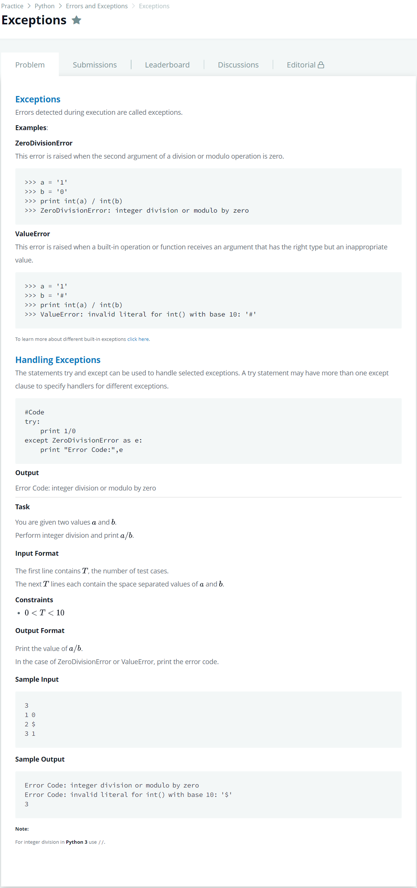

# [Exceptions](https://www.hackerrank.com/challenges/exceptions/problem)




### My Answer

```python
for i in range(int(input())) : 
    a,b = input().replace('\n','').split(' ')
    try : 
        print(int(a)//int(b))
    except Exception as e : 
        print('Error Code:',e)
```

* Time Complexity : O(n)
* Space Complexity : O(2n)


### The things I got
