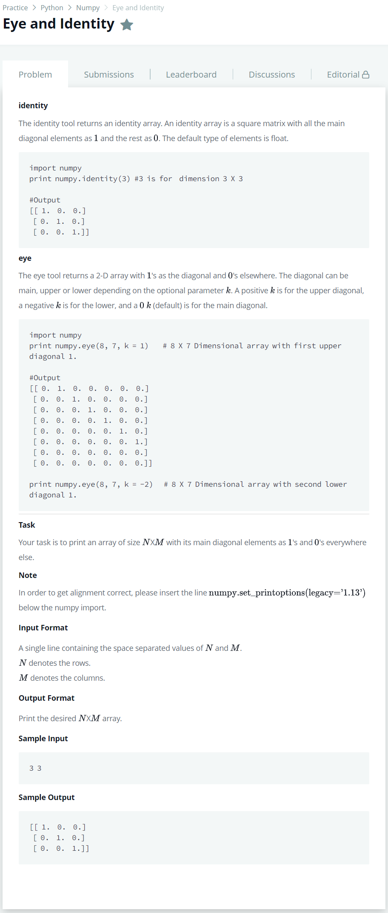

# [Eye and Identity](https://www.hackerrank.com/challenges/np-eye-and-identity/problem)




### My Answer

```python
import numpy as np
np.set_printoptions(legacy='1.13')

print(np.eye(*[int(x) for x in input().split(' ')], k = 0))
```

* Time Complexity : O(n)
* Space Complexity : O(n)


### The things I got
