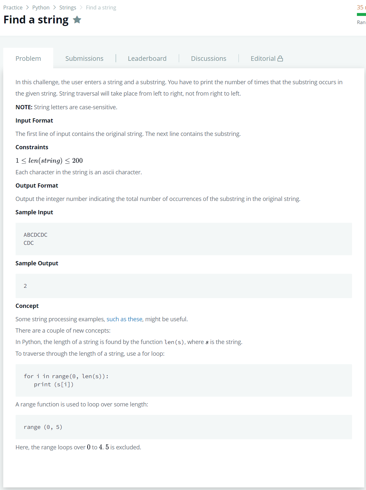

# [Find a String](https://www.hackerrank.com/challenges/find-a-string/problem)




### My Answer

```python
def count_substring(string, sub_string):
    length = len(sub_string)
    count=0
    for i in range(len(string)-length+1) : 
        if string[i:i+length] == sub_string : count+=1
    return count
```

* Time Complexity : O(n)
* Space Complexity : O(n)


### The things I got
