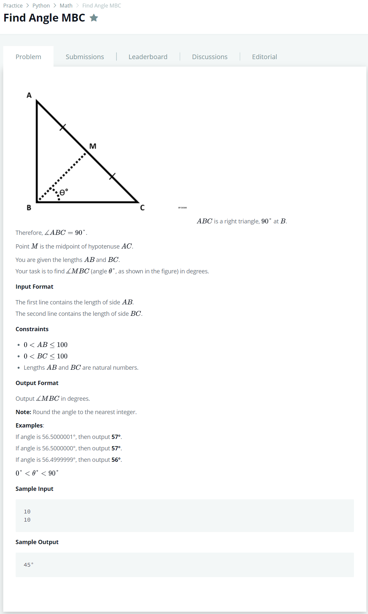
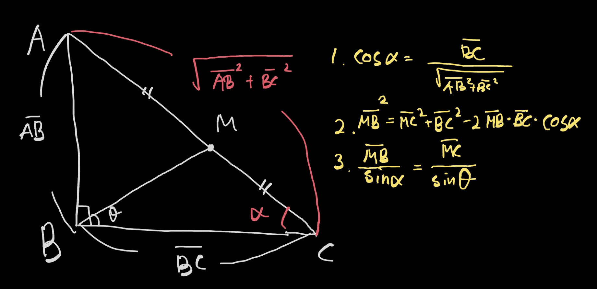

# [Find Angle MBC](https://www.hackerrank.com/challenges/find-angle/problem)




### My Answer

  

```python
import math
import sys

AB, BC = int(input()), int(input())
AC = (AB**2 + BC**2)**.5
MC = AC/2
alpha = math.acos(BC/AC)
MB = (MC**2 + BC**2 - 2*MC*BC*math.cos(alpha))**.5
theta = math.asin(math.sin(alpha)*MC/MB)

print(str(round(math.degrees(theta)))+chr(176))
```

* Time Complexity : O(1)
* Space Complexity : O(1)


### The things I got
