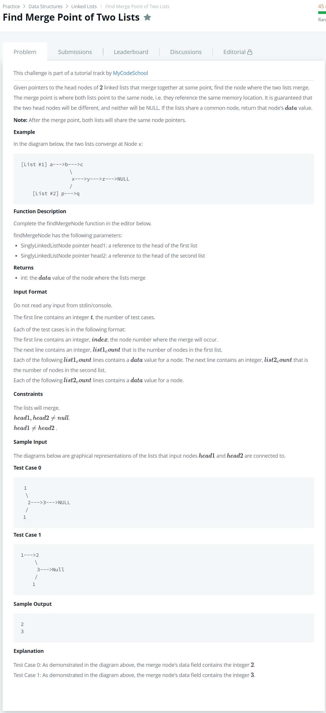

# [Find Merge Point Of Two Lists](https://www.hackerrank.com/challenges/find-the-merge-point-of-two-joined-linked-lists/problem)




### My Answer

```python
from collections import defaultdict

def findMergeNode(head1, head2):
    hashmap = defaultdict(int)
    while head1 : 
        hashmap[head1]+=1
        head1 = head1.next    
    
    while head2 : 
        if hashmap[head2]==1 : 
            break
        head2 = head2.next
    return head2.data
```

* Time Complexity : O(2n)
* Space Complexity : O(n)


### The things I got
