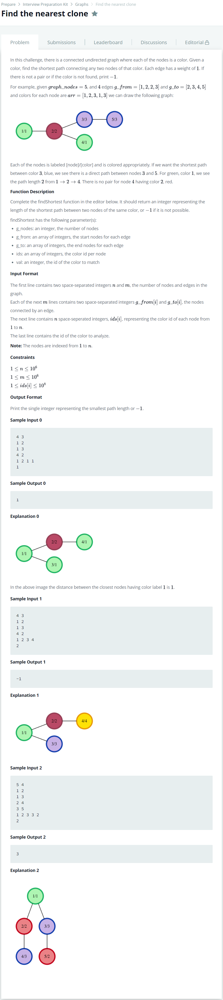

# [Find the nearest clone](https://www.hackerrank.com/challenges/find-the-nearest-clone/problem)




### My Answer

```python
def makeGraph(graph_from, graph_to) : 
    G = defaultdict(list)
    for i in range(len(graph_from)) : 
        G[graph_from[i]].append(graph_to[i])
        G[graph_to[i]].append(graph_from[i])
        
    return G

def findColorNode(ids, val):
    return val
    for i in range(len(ids)) : 
        if ids[i]==val : 
            return i       

def findShortest(graph_nodes, graph_from, graph_to, ids, val):
    
    from queue import Queue
    
    ids.insert(0,0)
    G = makeGraph(graph_from, graph_to)
    visited = [0 for _ in range(graph_nodes+1)]
    start = findColorNode(ids, val)
    visited[start]=1
    
    Q = Queue()
    
    
    now = start
    Q.put((start,0))
    results = []
    while Q.qsize() : 

        now,now_count = Q.get()
    
        if ids[now] == val and visited[now]==0:
            results.append(now_count)
    
        visited[now]=1
        for near in G[now] : 
            if visited[near]==1 : 
                continue
            else : 
                Q.put((near,now_count+1))

    return min(results) if results else -1
```

* Time Complexity : O(N+2E)
* Space Complexity : O(N+E)


### The things I got
