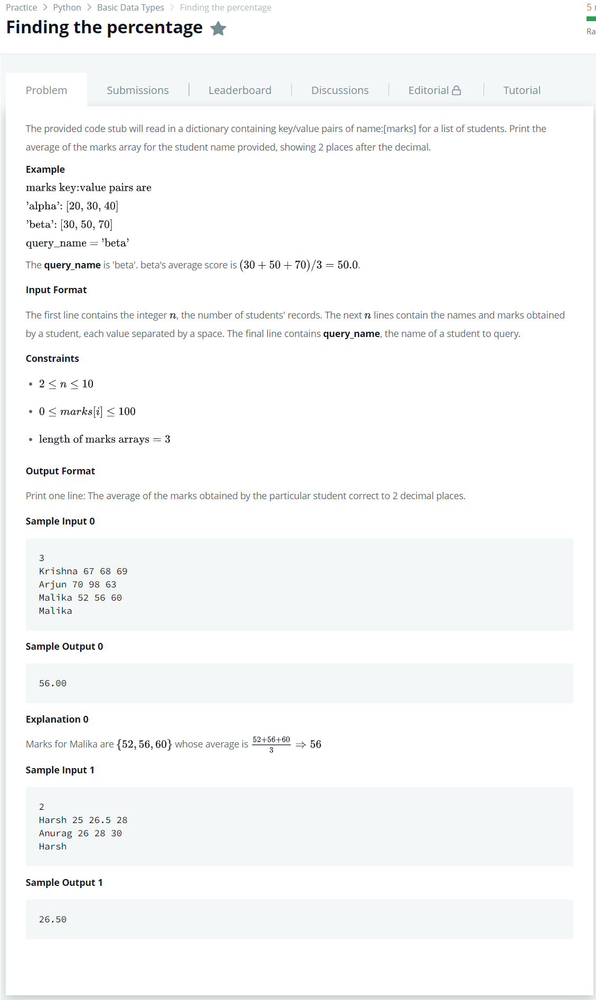

# [Finding The Percentage](https://www.hackerrank.com/challenges/finding-the-percentage/problem)




### My Answer

```python
if __name__ == '__main__':
    n = int(input())
    student_marks = {}
    for _ in range(n):
        name, *line = input().split()
        scores = list(map(float, line))
        student_marks[name] = scores
    query_name = input()
    
    print('%.2f'%(sum(student_marks[query_name])/3))
```

* Time Complexity : O(n)
* Space Complexity : O(n)


### The things I got
