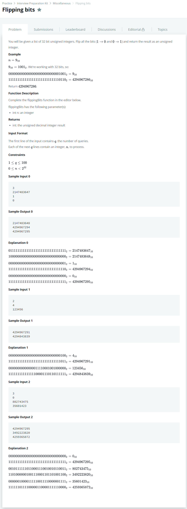

# [Flipping Bits](https://www.hackerrank.com/challenges/flipping-bits/problem)




### My Answer

```python
def flippingBits(n):
    formatted_bin = '{0:0>32}'.format(bin(n)[2:])
    return int('0b'+''.join([str(int(b)^1) for b in formatted_bin]),2)
```

* Time Complexity : O(n)
* Space Complexity : O(n)


### The things I got
