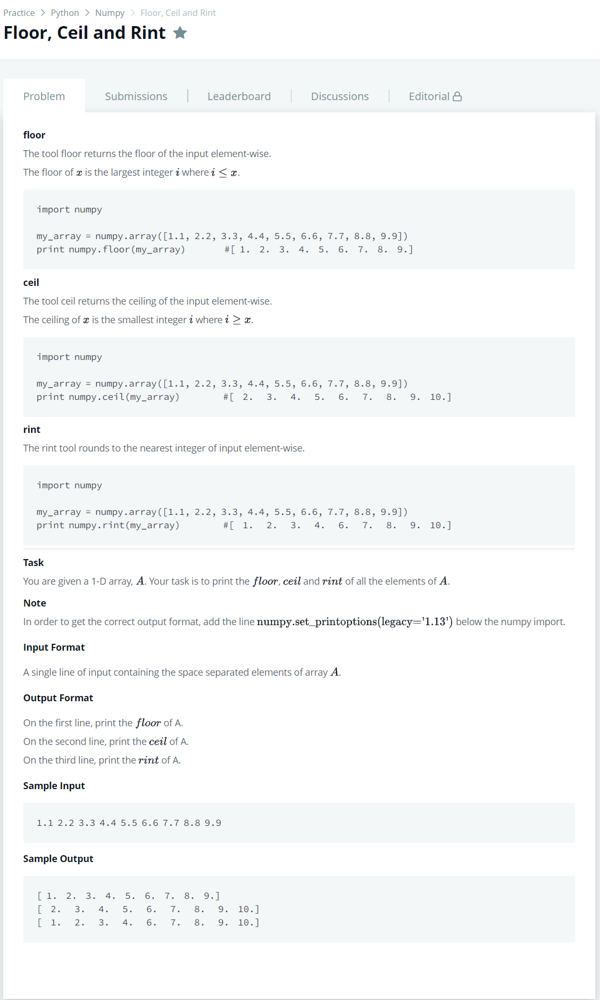

# [Floor, Ceil and Rint](https://www.hackerrank.com/challenges/floor-ceil-and-rint/problem)




### My Answer

```python
import numpy as np
np.set_printoptions(legacy='1.13')

array = np.array([float(x) for x in input().split(' ')])
print(np.floor(array))
print(np.ceil(array))
print(np.rint(array))
```

* Time Complexity : O(3n)
* Space Complexity : O(n)


### The things I got
